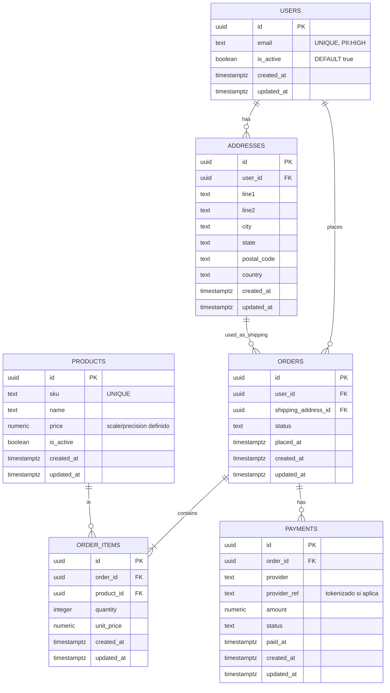
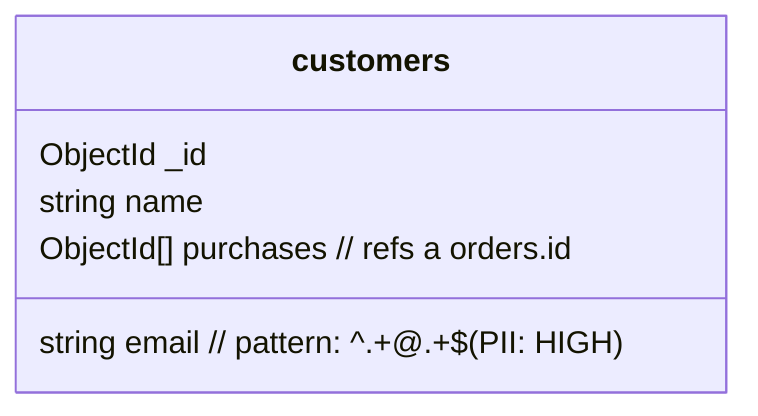
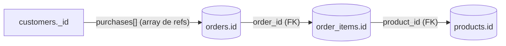
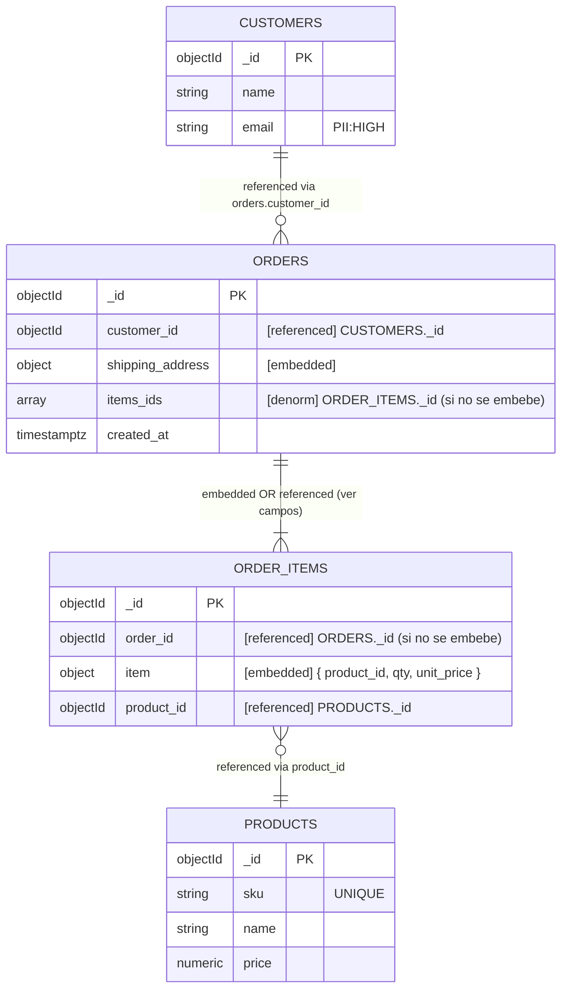

# Database Entidad-Relación

## Propósito y alcance

Representar **visualmente** el modelo de datos del proyecto, incluyendo entidades/colecciones,
cardinalidades y reglas de integridad, en formato **Mermaid** para consumo humano y de copilotos.
Este documento es la fuente de verdad de relaciones y debe actualizarse **antes** de modificar
esquemas o migraciones.

---

## Diagrama ER (bases relacionales)

---

## Claves foráneas y reglas de integridad

| Tabla       | Columna FK          | Referencia   | ON DELETE | ON UPDATE | Índice sugerido                  | Justificación                                                       |
| ----------- | ------------------- | ------------ | --------- | --------- | -------------------------------- | ------------------------------------------------------------------- |
| orders      | user_id             | users.id     | RESTRICT  | CASCADE   | `orders_user_id_idx`             | Prohibir eliminar usuarios con historial por auditoría/facturación. |
| orders      | shipping_address_id | addresses.id | SET NULL  | CASCADE   | `orders_shipping_address_id_idx` | Preservar órdenes si se depuran direcciones; mantener trazabilidad. |
| order_items | order_id            | orders.id    | CASCADE   | CASCADE   | `order_items_order_id_idx`       | Limpiar items dependientes al eliminar el pedido.                   |
| order_items | product_id          | products.id  | RESTRICT  | CASCADE   | `order_items_product_id_idx`     | Mantener trazabilidad de catálogo en historial de ventas.           |
| payments    | order_id            | orders.id    | CASCADE   | CASCADE   | `payments_order_id_idx`          | Un pago no tiene sentido sin el pedido asociado.                    |

---

## Overlay de PII y datos sensibles

| Entidad   | Atributo            | PII      | Protección requerida               |
| --------- | ------------------- | -------- | ---------------------------------- |
| users     | email               | HIGH     | Hash/enmascarado                   |
| orders    | shipping_address_id | INDIRECT | Redactar parcialmente              |
| addresses | line1/line2/...     | MODERATE | Enmascarar; nunca en logs públicos |
| payments  | provider_ref        | MODERATE | Tokenización                       |

---

## Estructuras no relacionales (visualización)

Para colecciones/documentos, usa vistas Mermaid que ilustren **estructura**, **anidamiento** y
**referencias lógicas**.

### customers (MongoDB) – estructura documental

### Relación lógica documentos ↔ relacional

### ER NoSQL anotado (embedded vs. referenced vs. denorm)

**Convención de tags**:

- `[embedded]` documento embebido
- `[referenced]` referencia por id (lookup)
- `[denorm]` denormalización para lectura rápida

---

## Reglas de actualización del ER

1. **Primero aquí, luego código y migraciones**: cualquier cambio de relación se documenta primero
   en `database.md` (detalle estructural) y `database-er.md` (diagrama). Luego se implementa el
   cambio en el código de la aplicación (modelos, repositorios, APIs) y, por último, se crea y
   ejecuta la **migración de base de datos** correspondiente —es decir, el script que aplica esos
   cambios en el esquema real (crear/alterar/eliminar tablas, columnas, índices o relaciones).
1. **Compatibilidad con copilotos**: describir propósito y relaciones en texto breve junto al
   diagrama para reducir ambigüedad.
1. **Convenciones**: `snake_case`, PK `id`, FKs `<entidad>_id`, `created_at`/`updated_at` UTC.
1. **Formato Markdown**: seguir `markdown-guidelines.md` (encabezados ATX, tablas estándar, fences
   con lenguaje).

---

## Checklist para PRs que tocan datos

- [ ] Diagrama Mermaid actualizado y válido.
- [ ] Relaciones del diagrama **etiquetadas con la columna FK** y comentario `%%` con ON
      DELETE/UPDATE.
- [ ] Tabla de FKs actualizada con columna **Justificación** por cada regla.
- [ ] Migración alineada al orden: docs (`database.md` + `database-er.md`) → **código**
      (modelos/repositorios/APIs) → **migración**.
- [ ] Overlay PII revisado (campos nuevos rotulados y con controles).
- [ ] Migración con ruta **aditiva → backfill → switch de código → limpieza** y rollback definido.
- [ ] Linters/validadores de `database.md` y `database-er.md` en pre-commit/CI pasan sin warnings.
